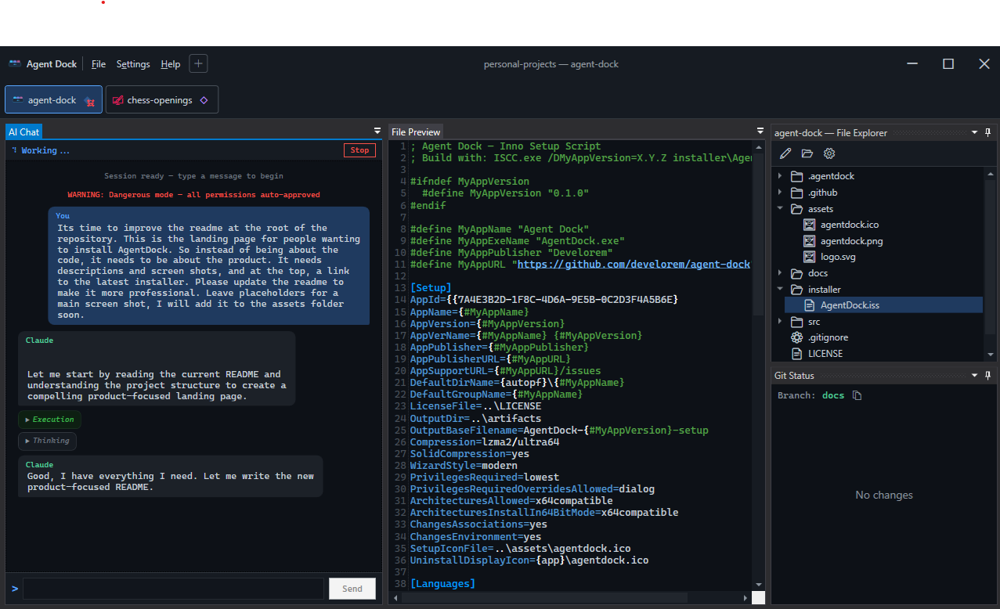

  

<h1 align="center">Agent Dock</h1>

  <strong>One window. Every project. All your AI coding sessions.</strong>

  
  &nbsp;
  
  &nbsp;
  
  &nbsp;
  

 

> **[Download the latest installer](https://github.com/develorem/agent-dock/releases/latest)** &mdash; requires [.NET 10 Runtime](https://dotnet.microsoft.com/download/dotnet/10.0) and a supported AI agent (currently [Claude Code](https://docs.anthropic.com/en/docs/claude-code))

 

  

---

## What is Agent Dock?

Agent Dock is a free, open-source desktop app for developers who use AI coding agents across multiple projects. Instead of juggling separate terminal windows, Agent Dock puts every session in one place — with a file explorer, git status, file preview, and AI chat panel for each project.

Switch between projects with a single click. See at a glance which sessions are working, which are waiting for input, and which are idle.

> **Currently supported:** [Claude Code](https://docs.anthropic.com/en/docs/claude-code). Support for additional agents and models is coming soon.

---

## Features

### Multi-Project Workspaces

Open as many project folders as you need, each in its own tab. Every tab gets a fully independent workspace — rearrange panels, float them, or tab them together however you like.

### AI Chat Panel

A terminal-style interface for interacting with your AI agent. Messages stream in real-time, past conversation history collapses to keep things tidy, and permission prompts appear inline — no disruptive pop-ups.

### File Explorer

A read-only tree view of your project that respects `.gitignore`. Click any file to preview it instantly.

### Git Status

See staged and unstaged changes at a glance with color-coded indicators. Click a changed file to view its diff in the preview panel.

### File Preview

Syntax-highlighted code for dozens of languages, rendered markdown, image previews, and inline diffs — all without leaving Agent Dock.

### Toolbar Status Icons

Each project tab in the toolbar shows the agent's current state: idle, working, or waiting for input. A red badge warns you when a session is running in dangerous mode.

### Themes

Six built-in themes — choose between light and dark variants to match your preferences. Every panel, including the AI chat, respects the active theme.

### Workspace Save & Load

Save your entire session — open projects, panel layouts, toolbar position, theme — and restore it later. Recent workspaces are a click away from the File menu.

---

## Getting Started

1. Install [.NET 10 Runtime](https://dotnet.microsoft.com/download/dotnet/10.0) and a supported agent ([Claude Code](https://docs.anthropic.com/en/docs/claude-code))
2. Download Agent Dock from the [Releases page](https://github.com/develorem/agent-dock/releases/latest)
3. Launch the app, click **+** to add a project, and start an AI session

**[Full installation guide &rarr;](INSTALL.md)**

---

## Documentation

- **[Features](docs/features.md)** — overview of everything Agent Dock can do
- **[Workspace](docs/workspace.md)** — saving, loading, themes, and settings
- **[Projects](docs/projects.md)** — tabs, project settings, and panel layouts
- **[Project Features](docs/project-features.md)** — File Explorer, Git Status, and File Preview
- **[AI Chat](docs/ai-chat.md)** — sessions, message types, and troubleshooting

---

## Contributing

Contributions are welcome. Please [open an issue](https://github.com/develorem/agent-dock/issues) first to discuss what you'd like to change.

## License

[MIT](LICENSE)

---

  Built by <a href="https://github.com/develorem">Develorem</a>

