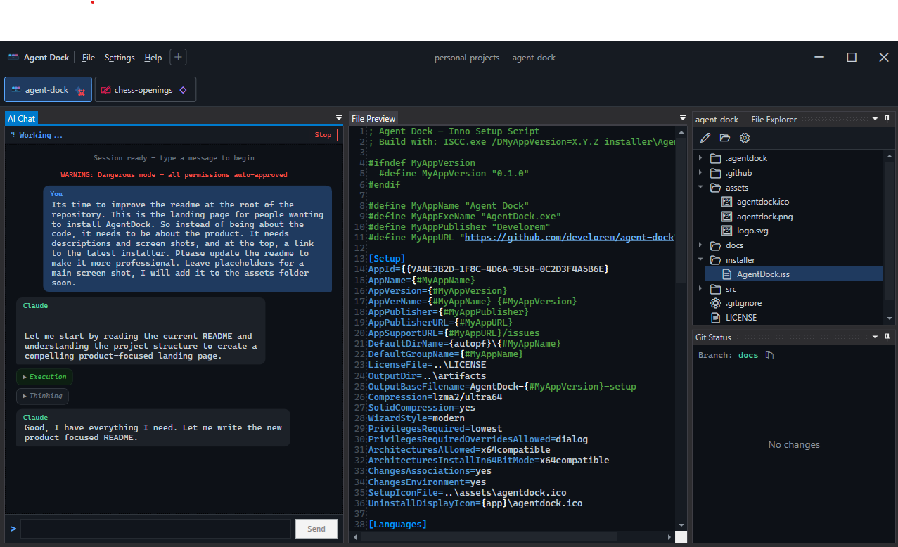

  

<h1 align="center">Agent Dock</h1>

  <strong>One window. Every project. All your AI coding sessions.</strong>

  
  &nbsp;
  
  &nbsp;
  
  &nbsp;
  

 

> **[Download the latest installer](https://github.com/develorem/agent-dock/releases/latest)** &mdash; requires [.NET 10 Runtime](https://dotnet.microsoft.com/download/dotnet/10.0) and a supported AI agent (currently [Claude Code](https://docs.anthropic.com/en/docs/claude-code))

 

  

---

## What is Agent Dock?

Agent Dock is a free, open-source desktop app for developers who use AI coding agents across multiple projects. Instead of juggling separate terminal windows, Agent Dock puts every session in one place — with a file explorer, git status, file preview, and AI chat panel for each project.

Switch between projects with a single click. See at a glance which sessions are working, which are waiting for input, and which are idle.

> **Currently supported:** [Claude Code](https://docs.anthropic.com/en/docs/claude-code). Support for additional agents and models is coming soon.

---

## Features

### Multi-Project Workspaces

Open as many project folders as you need, each in its own tab. Every tab gets a fully independent workspace — rearrange panels, float them, or tab them together however you like.

### Tab Groups & Active Projects

Group your tabs when one row isn't enough, with per-group icons, colours and a status roll-up. A dynamic **Active** tab always shows the projects with a live session, most recently active first.

### AI Chat Panel

A terminal-style interface for interacting with your AI agent. Responses stream in, each turn collapses into a single activity bubble, and permission prompts appear inline — no disruptive pop-ups. Attach images, queue follow-ups while the agent works, schedule a message for later, and watch subagents as they run.

### Remote Sessions

Host this machine's live sessions for a second copy of Agent Dock on another machine, and drive them from there — chat, files, git and diffs all come from the host. TLS with a pinned certificate, an eight-character pairing code, and one driver at a time.

### Multiple Claude Accounts

Hold more than one Claude login and pick which one a session signs in as. The title bar shows each plan's 5-hour and 7-day quota separately, plus live cost and token counts.

### File Explorer

A read-only tree view of your project that respects `.gitignore`. Click any file to preview it instantly. It patches in place, so an agent rewriting files doesn't make it flicker or lose your place.

### Git Status

See staged and unstaged changes at a glance with color-coded indicators. Click a changed file to view its diff in the preview panel. Switch or create branches from the branch picker, or open the repo's page in your browser.

### File Preview

Syntax-highlighted code for dozens of languages, rendered markdown, image previews, and inline diffs — all without leaving Agent Dock.

### Toolbar Status Icons

Each project tab shows the agent's current state: idle, working, waiting for input, errored, or holding a scheduled message. A red badge warns you when a session is running in dangerous mode.

### Themes

Six built-in themes — choose between light and dark variants to match your preferences. Every panel, including the AI chat, respects the active theme.

### Workspace Save & Load

Save your entire session — open projects, panel layouts, tab groups, toolbar position, theme — and restore it later. Recent workspaces are a click away from the File menu and from the empty-state screen.

---

## Getting Started

1. Install [.NET 10 Runtime](https://dotnet.microsoft.com/download/dotnet/10.0) and a supported agent ([Claude Code](https://docs.anthropic.com/en/docs/claude-code))
2. Download Agent Dock from the [Releases page](https://github.com/develorem/agent-dock/releases/latest)
3. Launch the app, click **+** to add a project, and start an AI session

**[Full installation guide &rarr;](INSTALL.md)**

---

## Documentation

- **[Features](docs/features.md)** — the whole map of what Agent Dock can do
- **[Workspace](docs/workspace.md)** — saving, loading, and what a workspace stores
- **[Tab Groups](docs/groups.md)** — groups, status roll-up, and the Active Projects tab
- **[Projects](docs/projects.md)** — tabs, status indicators, project settings, panel layouts
- **[Panels](docs/project-features.md)** — File Explorer, Git Status, File Preview, Description, Todo
- **[AI Chat](docs/ai-chat.md)** — sessions, images, the send queue, scheduling, slash commands
- **[Accounts](docs/accounts.md)** — multiple Claude logins, plan usage, cost and tokens
- **[Remote Sessions](docs/remote-sessions.md)** — driving one machine's agents from another
- **[Settings](docs/settings.md)** — app, workspace and project settings, sounds, themes, updates, logs

Release notes for every version live in [`docs/release-notes/`](docs/release-notes).

---

## Contributing

Contributions are welcome. Please [open an issue](https://github.com/develorem/agent-dock/issues) first to discuss what you'd like to change.

**If a pull request adds or changes a user-facing feature, update the docs in the same PR.** The topic pages under [`docs/`](docs) are the user manual, not a changelog — a release note describing a feature is not a substitute for the page that explains how to use it.

## License

[MIT](LICENSE)

---

  Built by <a href="https://github.com/develorem">Develorem</a>

